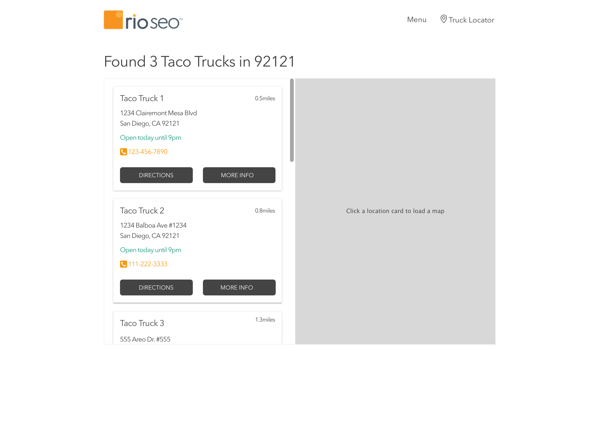
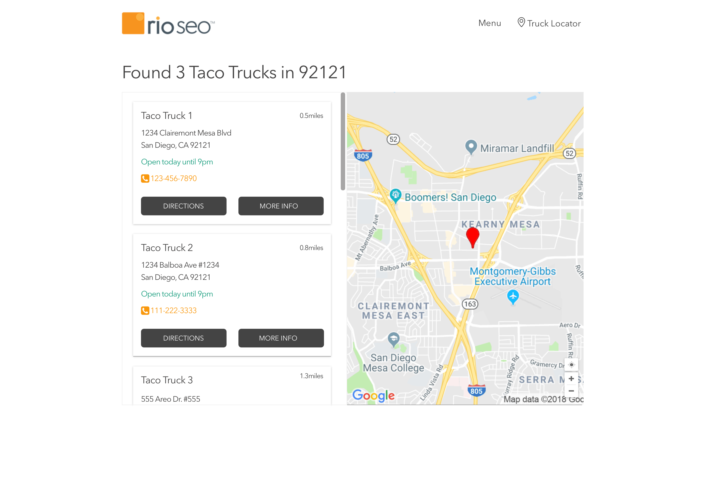
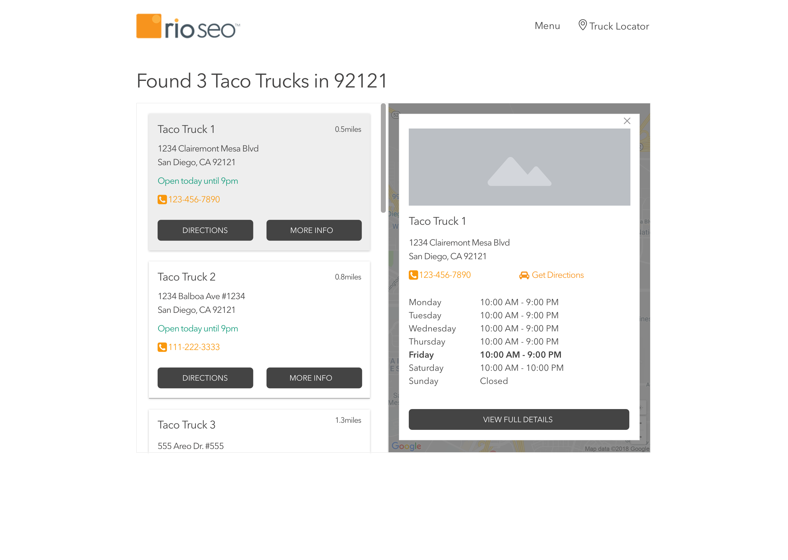
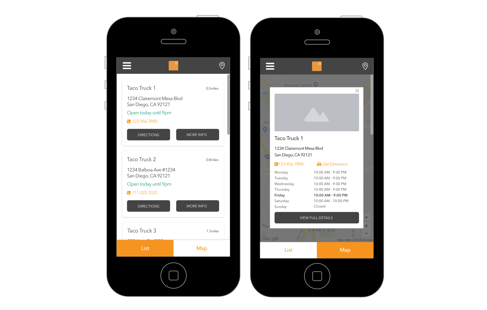

## Taco Truck Locator Code Assessment

Taco Truck Co. would like a simple truck locator to be created. This locator will show the businesses where the taco trucks are parked in front of.

You are given an API call that provides you with this location data in JSON format. The API call will respond to GET requests to the following URL: https://my.api.mockaroo.com/locations.json?key=a45f1200

Here is a single locations sample data:
```json
{
    "id": 1,
    "name": "Schmeler Inc",
    "url": "http://mapy.cz/quam/sapien/varius/ut.jsp",
    "address": "742 Bashford Court",
    "city": "Fort Wayne",
    "state": "IN",
    "postal_code": "46862",
    "latitude": "41.0938",
    "longitude": "-85.0707",
    "monday_open": "9:41 AM",
    "monday_close": "4:42 PM",
    "tuesday_open": "9:08 AM",
    "tuesday_close": "9:49 PM",
    "wednesday_open": "6:56 AM",
    "wednesday_close": "5:15 PM",
    "thursday_open": "9:57 AM",
    "thursday_close": "8:10 PM",
    "friday_open": "6:43 AM",
    "friday_close": "5:31 PM",
    "saturday_open": "6:45 AM",
    "saturday_close": "4:43 PM",
    "sunday_open": "8:14 AM",
    "sunday_close": "4:05 PM"
}
```

__The final project should look similar these mocks:__ 
1. Initial load screen will present a list of locations.


2. When you click or tap on a location address card from the list, a static map with that location latitude and longitude should be asyncronously rendered.


3. When you click or tap the "MORE INFO" button, an overlay with extended location data will load asyncronosly.


4. From the overlay, the "VIEW FULL DETAILS" should open the location's url in a new window.

5. When you click or tap "DIRECTIONS", open Google Maps in a new window with the locations address populated as the end point for the route.

6. The website should be responsive such that the mobile interface looks like the following mocks.
